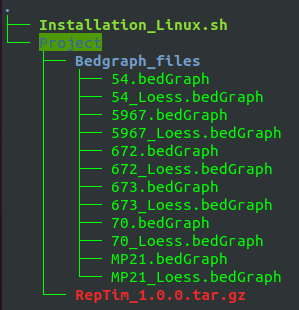

<h1 align="center">R versions</h1>

This repository proposes to use an isolated R environment for projects thanks to a container image

Files allowing to use an R version in a RStudio console (Docker) are available in this repository.


&nbsp;


## Use an R environment in a Docker container

### Linux:

1) Install Docker Engine

2) Build a "Project" folder including, for example, input files or some R packages to install

3) Position the file named "Installation_Linux.sh" upstream from the "Project" folder. \
   Below, the tree structure for an example of files for a RepTim project:

<div align="center"></div>

4) Run the bash commands:

```
sudo ./Installation_Linux.sh
sudo ./R_env.sh
```

5) Go to "http://localhost:8787/" address thanks to your web browser

### Windows:

1) Install Docker Desktop

2) Build a "Project" folder including, for example, input files or some R packages to install

3) Position the file named "Installation_Windows.bat" upstream from the "Project" folder (see the tree structure in the "Linux" paragraph)

4) Double-click on the file named "Installation_Windows.bat" then double-click on the new file named "R_env.bat"

5) On the Docker Desktop interface, click on "Containers" tab then click on "8787:8787" in the "Port(s)" column
